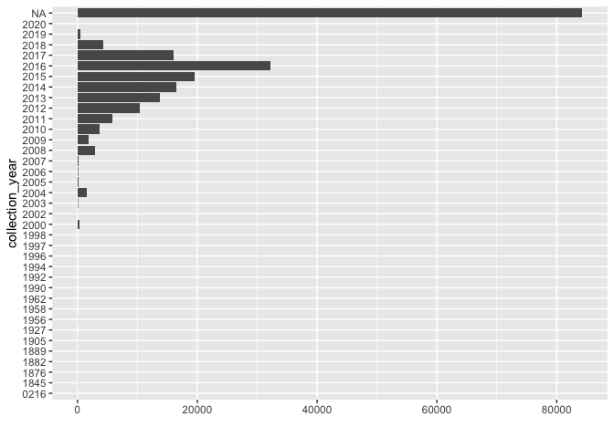
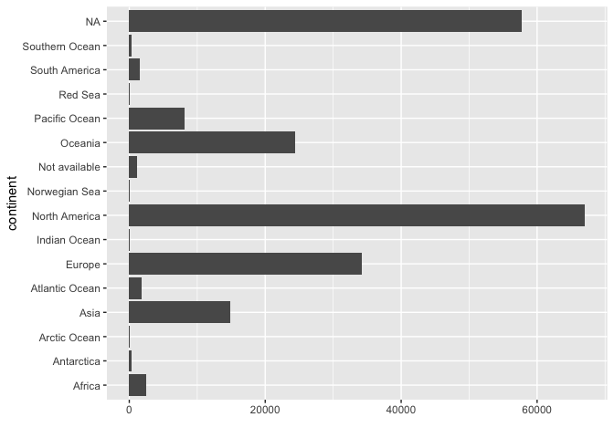
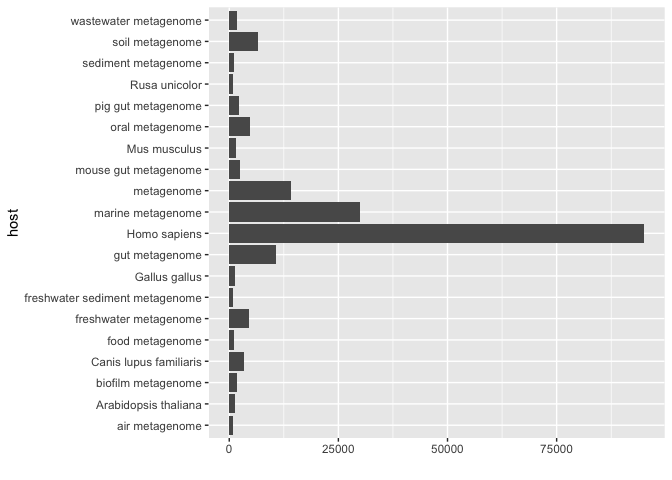
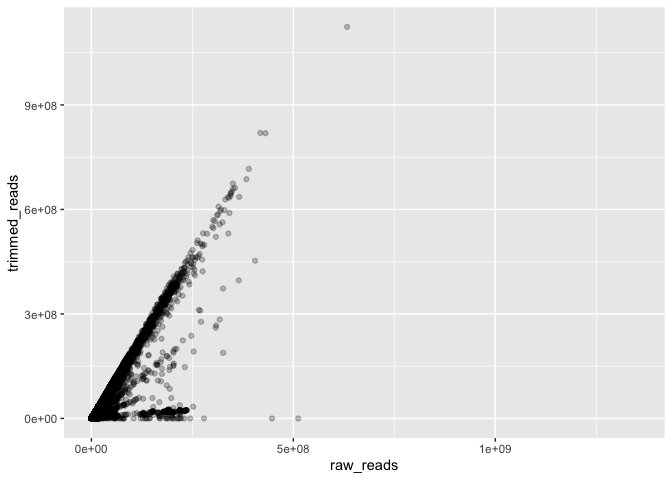

Visualizing metadata (R)
================

<small>Tutorial written by: Hannah-Marie Martiny
(<hanmar@food.dtu.dk>)<br> Last updated: 21-12-2021</small>

In this tutorial, a brief overview of the distribution of metadata
variables and how to visualize them is given.

## Setup

The various settings that are sensitive are stored in a config.json
file, but just change the settings to what fit your own setup.

``` r
library('rjson')
config <- fromJSON(file="../config.json")

database <- config$database # name of database
host <- config$host # host address of MySQL server
port <- config$port # port of MySQL server
user <- config$user # user name
passwd <- config$password # password for user 
dataDir <- config$datadir # directory where data files are stored
```

And import other libraries for retrieving data, manipulating and
plotting

``` r
library(ggplot2)
library(RMySQL)
```

    ## Loading required package: DBI

``` r
library(dplyr)
```

    ## 
    ## Attaching package: 'dplyr'

    ## The following objects are masked from 'package:stats':
    ## 
    ##     filter, lag

    ## The following objects are masked from 'package:base':
    ## 
    ##     intersect, setdiff, setequal, union

## Load metadata

The metadata are available in either the MySQL table `metadata` or in
TSV format in the file `metadata.tsv` and HDF5 format `metadata.h5`.
Here, we use the MySQL database.

``` r
mydb = dbConnect(MySQL(), user=user, password=passwd, host=host, port=as.integer(port), dbname=database)
rs = dbSendQuery(mydb, "select * from metadata")
metadata = fetch(rs, n=-1) # retrieve all with n=-1
```

Some preprocessing is required before we look at the data:

``` r
metadata$collection_date <- as.Date(metadata$collection_date)
metadata[which(metadata$collection_date > '2020-01-01'), 'collection_date'] <- NA # cannot be later than this date

# combine host laels metagenome and metagenomes into one
metadata[which(metadata$host == 'metagenomes'), 'host'] <- 'metagenome'
```

## What metadata do we have?

There are a multitude of different metadata associated with each
metagenomic dataset. Let’s us see which columns we have:

``` r
str(metadata)
```

    ## 'data.frame':    214022 obs. of  18 variables:
    ##  $ run_accession      : chr  "DRR000836" "DRR000980" "DRR000981" "DRR001376" ...
    ##  $ sample_accession   : chr  "SAMD00002573" "SAMD00010106" "SAMD00010105" "SAMD00006238" ...
    ##  $ project_accession  : chr  "PRJDA61421" "PRJDB2325" "PRJDB2325" "PRJDA72837" ...
    ##  $ country            : chr  NA NA NA NA ...
    ##  $ location           : chr  NA NA NA NA ...
    ##  $ continent          : chr  NA NA NA NA ...
    ##  $ collection_date    : Date, format: NA NA ...
    ##  $ tax_id             : num  939928 1006967 1006967 9606 410658 ...
    ##  $ host               : chr  "rhizosphere metagenome" "shoot metagenome" "shoot metagenome" "Homo sapiens" ...
    ##  $ host_tax_id        : num  NA NA NA 9606 NA ...
    ##  $ instrument_platform: chr  "LS454" "LS454" "LS454" "ILLUMINA" ...
    ##  $ instrument_model   : chr  "454 GS FLX Titanium" "454 GS FLX" "454 GS FLX" "Illumina Genome Analyzer IIx" ...
    ##  $ library_layout     : chr  "SINGLE" "SINGLE" "SINGLE" "SINGLE" ...
    ##  $ raw_reads          : num  1268608 1207522 802422 336278 21452087 ...
    ##  $ trimmed_reads      : num  1247751 1190673 792888 256975 5146184 ...
    ##  $ raw_bases          : num  6.41e+08 5.96e+08 4.24e+08 4.20e+07 3.22e+09 ...
    ##  $ trimmed_bases      : num  4.12e+08 4.17e+08 3.04e+08 2.65e+07 3.36e+08 ...
    ##  $ trimmed_fragments  : num  1247751 1190673 792888 256975 7991359 ...

The `run_accession` column contains the identifier for each metagenomic
dataset and can be used to connect the mapping results to metadata (as
seen in other tutorials).

In the paper, we have looked at the distribution of samples according to
the following columns: `continent`, `host`, `collection_year` (from the
`collection_date`), number of raw reads (`raw_reads`) vs trimmed reads
(`trimmed_reads`). So let’s replicate these figures.

### Distribution of metagenomes according to: `collection_year`

We first create the column `collection_year` from the `collection_date`
column, and then we count the number of samples per year. Finally, we
visualize these counts in a barplot with ggplot2.

``` r
# create year column
metadata['collection_year'] <- format(metadata$collection_date, '%Y')

#  group data by year and count number of run_accessions and plot
metadata %>% group_by(collection_year) %>% summarise(n_runs = n_distinct(run_accession)) %>%
  ggplot() +
  geom_col(aes(y=collection_year, x=n_runs)) +
  xlab('')
```

<!-- -->

### Distribution of metagenomes according to: `continent`

This is a pretty similar process as for looking at the distribution of
samples according to sampling year, instead we just look at the
`continent` labels.

``` r
#  group data by continent and count number of run_accessions and plot
metadata %>% group_by(continent) %>% summarise(n_runs = n_distinct(run_accession)) %>%
  ggplot() +
  geom_col(aes(y=continent, x=n_runs)) +
  xlab('')
```

<!-- -->
### Distribution of metagenomes according to: `host` This is a pretty
similar process as for looking at the distribution of samples according
to sampling year, instead we just look at the `host` labels.

NOTE: There are many host labels, so let us look at the 20 most frequent
ones.

``` r
#  group data by continent and count number of run_accessions
hostCounts <- metadata %>% group_by(host) %>% summarise(n_runs = n_distinct(run_accession))

# plot top 20
hostCounts %>% arrange(n_runs) %>% tail(20) %>% ggplot() +
  geom_col(aes(y=host, x=n_runs)) +
  xlab('')
```

<!-- -->
### Distribution of metagenomes according to: `raw_reads` and
`trimmed_reads`. Instead of making a bar plot, we can also look at the
number of sequencing reads available before and after trimming in a
scatter plot.

``` r
ggplot(metadata, aes(x=raw_reads, y=trimmed_reads)) +
  geom_point(alpha=.25)
```

    ## Warning: Removed 77295 rows containing missing values (geom_point).

<!-- -->
